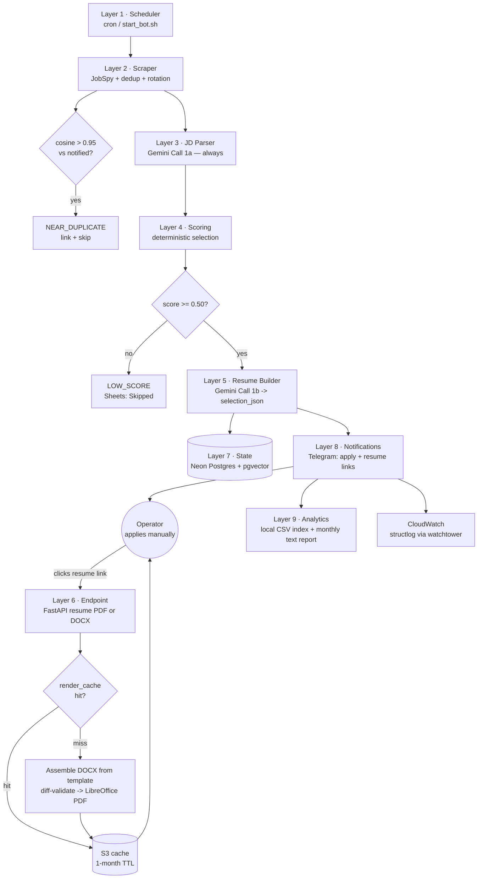

<h1 align="center">Job Application Bot</h1>

<p align="center">
  A nine-layer pipeline that scrapes Indian job listings, scores them against a master profile,<br>
  and builds a tailored resume per match — delivered over Telegram, reviewed in a local dashboard.
</p>

<p align="center">
  
  
  
  
  
  
  
  
  
  
  <br>
  <a href="https://vishnujan-narayanan.vercel.app/"></a>
  <a href="https://github.com/VishnujanNarayanan"></a>
  <a href="https://www.linkedin.com/in/vishnujan-narayanan"></a>
  <a href="https://substack.com/@vishnujannarayanan"></a>
</p>

<p align="center">
  🎯 <a href="#why-this-project-exists">Why</a> ·
  🏷️ <a href="#version-history">Versions</a> ·
  🧩 <a href="#architecture">Architecture</a> ·
  🧠 <a href="#design-decisions">Design Decisions</a> ·
  ⚡ <a href="#installation">Installation</a> ·
  ⚙️ <a href="#configuration">Configuration</a> ·
  🧑‍💻 <a href="#usage">Usage</a> ·
  🧪 <a href="#testing">Testing</a> ·
  ⚠️ <a href="#limitations">Limitations</a>
</p>

---

## Version history

### v1.0.0 — released 2026-08-08

The nine-layer pipeline described in this README, running end to end:

- **Scraping** via JobSpy, currently LinkedIn-only (Indeed and Glassdoor are disabled while
  `apis.indeed.com` is unreachable from the operator's network).
- **Parsing** through Gemini 2.5 Flash with Instructor + Pydantic validation, two calls per job max.
- **Deterministic scoring and selection** — bullets chosen by sentence-transformer similarity,
  never written by the LLM.
- **On-demand resume rendering** — `selection_json` in Postgres, PDF/DOCX assembled when a link is
  clicked, diff-validated against the operator's template.
- **Telegram delivery** — per-match messages bundling apply and resume links.
- **Google Sheets index + monthly Gemini Docs report** for analytics.
- **ngrok-published endpoint** so resume links resolve from a phone while the laptop is awake.
- 101 unit tests, all external services mocked; CI on every push and pull request.

Fixed for this release: `send_match_notification` read the apply threshold from a config section
that does not exist, raising `AttributeError` before the send. The orchestrator caught it and
logged `notification_error`, so live match notifications had been failing silently.

Triggered by host cron or `scripts/start_bot.sh`; runs only while the operator's laptop is on.

### v2.0.0 — unreleased

The theme is **making the system usable from a phone without leaving it exposed.**

- **Google removed.** Sheets and Docs are gone, along with four pip packages, a service-account
  JSON, three env vars and a bind mount. The analytics index is now local CSV files *derived from
  Postgres* rather than appended during a run — which is what lets a run that happened on a
  throwaway CI runner show up in the local files with no sync step.
- **Laptop-off runs.** A manually-dispatched GitHub Actions workflow runs the whole pipeline on
  GitHub's runners, triggerable from the GitHub mobile app. The operator profile and resume
  template travel through S3, since they exceed GitHub's 48 KB secret limit.
- **Resumes that survive a sleeping laptop.** Matched jobs are pre-rendered to S3 during the run
  and delivered as presigned links, so a notification from a remote run is fully actionable. This
  amends hard rule #8 by explicit decision; it remains an expiring cache, not a permanent pile.
- **A browser dashboard** served by the existing FastAPI app — matches, near-misses, apply and
  resume links, and a Run button that goes either local or remote.
- **ngrok replaced by Tailscale.** The endpoint has no authentication and ngrok published it to the
  entire internet on a guessable URL scheme. It now binds loopback only and is reached over a
  private mesh.
- Match notifications fixed (see v1.0.0), 154 tests, and one search term per run by default to
  keep per-run LLM spend low.

---

## Why this project exists

Applying to jobs at volume forces a bad trade. Send the same resume everywhere and it matches
nothing; tailor each one by hand and the throughput collapses. The usual automation answer —
a bot that fills forms and submits applications — solves throughput by creating two worse
problems: it risks the account it acts on, and it produces claims the applicant cannot defend in
an interview.

This system takes the opposite position. **It never applies to anything.** It does the part that
is genuinely mechanical — finding listings, parsing requirements, scoring fit, and assembling the
best-matching subset of an already-written profile — and hands back an apply link plus a resume
link. A human clicks apply.

The core value is the JD → tailored-resume engine. Every bullet on every generated resume comes
verbatim from `master_profile.yaml`; the selection is sentence-transformer maths, not LLM
authorship. That constraint is what makes the output defensible.

## Features

- **Multi-portal scraping** via JobSpy — LinkedIn, Indeed, Glassdoor (public listings only).
- **Near-duplicate detection** — cosine > 0.95 on JD embeddings links cross-portal reposts to
  the original instead of notifying twice.
- **Structured JD parsing** — Gemini via Instructor returns a validated Pydantic model, never
  hand-parsed JSON.
- **Deterministic scoring** — a locked, documented formula over experiences, projects, summaries,
  and skills; notify at ≥ 0.50.
- **Tailored resume selection** — a ~2 KB `selection_json` per job, not a rendered PDF.
- **On-demand rendering** — FastAPI serves `/resume/{job_id}.pdf|.docx`, assembling the DOCX from
  the operator's template and converting via headless LibreOffice.
- **Diff-validated assembly** — a render that changes anything outside permitted regions fails
  rather than shipping; the resume header is never touched.
- **Build-time pre-render** — matched resumes are rendered to S3 as the run happens and delivered
  as presigned links, so they work even when the laptop that hosts the endpoint is switched off.
- **Telegram delivery** — match notifications with Apply, Resume PDF, and Resume DOCX buttons.
- **Browser dashboard** — matches and near-misses with apply and resume links, plus a Run button
  that starts the pipeline locally or dispatches it to GitHub Actions.
- **Laptop-off runs** — a manually-dispatched GitHub Actions workflow runs the whole pipeline on
  GitHub's runners, triggerable from the GitHub mobile app.
- **Analytics** — a local CSV index (Matches / Skipped / Near-duplicates) derived from Postgres,
  plus a monthly Gemini-written text report.
- **Free tier throughout** — Neon, Telegram, AWS S3 and CloudWatch, GitHub Actions.
- **Instance-ready** — no operator identity in `src/`; a second operator swaps config files and
  runs their own instance with zero code edits.

## Architecture

Nine layers, each owning one stage of the pipeline.



### Layer status

| Layer | Component | Status | Implementation |
|---|---|---|---|
| 1 | Scheduler | ✅ Real | Manually-dispatched GitHub Actions workflow |
| 2 | Scraper | ✅ Real | JobSpy + dedup + term rotation |
| 3 | JD Parser | ✅ Real | Gemini Call 1a with Pydantic validation |
| 4 | Scoring | ✅ Real | Deterministic selection, notify ≥ 0.50 |
| 5 | Resume Builder | ✅ Real | Gemini Call 1b → `selection_json` |
| 6 | Endpoint | ✅ Real | FastAPI PDF/DOCX render + operator dashboard |
| 7 | State | ✅ Real | Neon Postgres + pgvector, master-profile rebuild |
| 8 | Notifications | ✅ Real | Telegram matches + dry-run summaries |
| 9 | Analytics | ✅ Real | Local CSV index + monthly text report |

### Module map

| Path | Responsibility |
|---|---|
| `src/main.py` | Pipeline orchestrator, run lock, dry-run handling |
| `src/scraper/` | `jobspy_wrapper`, `filters`, `rotation` |
| `src/parser.py` | JD parsing (Gemini Call 1a) |
| `src/scorer/` | `embeddings`, `selector`, `ordering`, `apply_decision` |
| `src/builder/` | `llm_call` (Call 1b), `skills_validator` |
| `src/endpoint/` | `app`, `assembler`, `pdf_convert`, `cache`, `hyperlinks`, `dashboard`, `runner` |
| `src/endpoint/templates/`, `static/` | Dashboard markup, CSS and JS (no build step) |
| `src/state/` | `db`, `models`, `master_profile`, `cleanup`, Alembic migrations |
| `src/llm/` | `client`, `prompts`, `schemas` |
| `src/aws/` | `s3`, `cloudwatch`, `iam_session` |
| `src/analytics.py` | Local CSV index (derived from Postgres) and monthly text report |
| `src/notifications.py` | Telegram formatting and delivery |
| `src/cli/` | `dryrun`, `inspect`, `reparse`, `report`, `export`, `assets`, `aws_check` |
| `.github/workflows/pipeline.yml` | Layer 1 — the laptop-off pipeline run |

## Design Decisions

**No auto-apply, ever.** The system does not submit applications, fill forms, answer screening
questions, or take any action on an operator's portal account. This was a deliberate pivot away
from a Playwright-based auto-applier built in earlier iterations. It removes account-ban risk
entirely and keeps a human in the loop on every submission.

**LinkedIn is a listings source, not an account.** JobSpy reads public listings. Nothing logs
into or acts on the operator's account, so the risk that actually matters never arises.

**The LLM never writes or selects bullet content.** Bullets come verbatim from
`master_profile.yaml`, chosen by sentence-transformer similarity. Gemini only picks a title from
an allow-list, names three skill categories from pre-scored candidates, and writes cover-letter
prose. Job titles are constrained with `Literal[tuple(safe_title_aliases)]`, so an out-of-set
title cannot be returned. **The operator must be able to defend every word in an interview** —
that constraint outranks match score.

**Selections are stored; PDFs are not.** Layer 5 writes a ~2 KB `selection_json` row. Rendering
happens when a link is clicked. This avoids accumulating a pile of PDFs that go stale the moment
the template changes, and it makes a template update retroactive: a stored
`template_version` mismatch triggers a re-render against the current template.

**Renders are diff-validated and the header is untouchable.** The assembler must not modify any
paragraph before the first `WORK EXPERIENCE` heading, which preserves the embedded GitHub,
LinkedIn, and certificate hyperlinks. Project and certificate link targets are rewritten by
`r:id` in `word/_rels/document.xml.rels`, leaving visible text unchanged. Any unexpected diff
raises `BUILD_FAILURE` instead of shipping a broken resume.

**A hard budget of two Gemini calls per job.** Call 1a parses every JD; Call 1b runs only when
the score clears 0.50. On the free tier this is the difference between finishing a run and
hitting a quota wall.

**No quotas on notifications.** Every match ≥ 0.50 notifies. Quotas existed to ration
auto-applications; with no auto-apply there is nothing to ration.

**The master profile is immutable from code.** It is read and validated, never written. Removing
a bullet sets `is_active = false` rather than deleting, so historical selections always resolve.

**Instance-ready, deliberately not SaaS.** No operator name, email, or filename literal appears
in `src/` — resume filenames are derived from `operator.full_name` in `config.yaml`. But there
are no `user_id` columns, no auth, and no tenant isolation. One instance serves one operator.

### Selection formula

```
EXPERIENCE  score = alias × 0.30 + top3_bullet_avg × 0.70
            max 3, min 2, threshold 0.45, force-include 2
            bullets: exactly 3, top by score
            order: best-match first if gap > 0.20, else recency

PROJECT     score = name × 0.20 + topN_bullet_avg × 0.80
            max 3, min 2, threshold 0.50, force-include 2, never hidden

SUMMARY     deterministic pool selection by JD match — no LLM

SKILLS      top-14 pool candidates → LLM names 3 categories (3–5 each)
            + up to 4 "Familiar With" gap skills; 10–14 pool + 0–4 gaps

SECTIONS    Summary → Work → [Skills / Projects by match] → Education → Certs

FINAL       fit × 0.55 + success_prob × 0.30 + recency × 0.10 + project × 0.05
            success_prob = seniority × 0.60 + recency × 0.40
            seniority weights: junior 1.0, mid 0.80, senior 0.40, lead 0.15
            notify + build at >= 0.50
```

## Project Structure

```
job_application_bot/
├── src/
│   ├── main.py                  # Orchestrator
│   ├── config.py                # Settings from config.yaml + .env
│   ├── scraper/ parser.py scorer/ builder/
│   ├── endpoint/                # Resume server, DOCX assembler, dashboard
│   │   ├── templates/ static/   # Dashboard markup, CSS, JS (no build step)
│   ├── state/                   # SQLAlchemy models, Alembic migrations
│   ├── llm/                     # Gemini client, prompts, Pydantic schemas
│   ├── aws/                     # S3, CloudWatch, IAM session
│   ├── analytics.py notifications.py scheduler.py reasons.py
│   └── cli/                     # dryrun, inspect, reparse, report, export, assets, aws_check
├── .github/workflows/pipeline.yml  # Layer 1 — the laptop-off pipeline run
├── tests/                       # 15 test modules, mocked external services
├── config/config.yaml           # All runtime tunables (checked in, no secrets)
├── resumes/templates/           # Operator DOCX template
├── data/index/ data/reports/    # Layer 9 CSV index and monthly reports (gitignored)
├── scripts/start_bot.sh         # Local runner: endpoint + tailscale check
├── Dockerfile docker-compose.yml
├── .env.example                 # Every secret the pipeline reads
├── master_profile.example.yaml  # Template for the operator's profile
└── requirements.txt
```

## Installation

Python 3.11+ is required.

```bash
git clone git@github.com:VishnujanNarayanan/Job_Application_Bot.git
cd Job_Application_Bot

python -m venv .venv
source .venv/bin/activate       # Windows: .venv\Scripts\activate

pip install -r requirements.txt
```

`requirements.txt` installs the spaCy `en_core_web_sm` model directly from a wheel URL and pins a
CPU-only PyTorch build (~200 MB rather than ~2 GB), so no extra download step is needed.

PDF conversion requires **LibreOffice** as a system binary — it is not a pip dependency. The
Docker image installs `libreoffice-writer`; a local install needs it on `PATH`.

### Operator setup

```bash
cp .env.example .env                              # fill in secrets
cp master_profile.example.yaml master_profile.yaml # write your profile
# place a DOCX template under resumes/templates/

python -m src.cli.aws_check    # verify S3 + IAM + CloudWatch
alembic upgrade head           # migrate the database
python -m src.cli.reparse      # parse profile -> DB embeddings + JSON
pytest                         # should pass green
```

### Docker (recommended)

Two runtime roles from one image:

| Service | Role | Lifecycle |
|---|---|---|
| `endpoint` | Always-on resume server, `uvicorn`, port 8000 | `docker compose up -d endpoint` |
| `pipeline` | On-demand scrape → parse → score → build → notify | `docker compose run --rm pipeline` |

First deploy, in order:

```bash
cp .env.example .env                     # DATABASE_URL, GEMINI_API_KEY, Telegram, AWS
# provide master_profile.yaml + a template under resumes/templates/
touch master_profile.json                # so the bind mount is a file, not a directory
docker compose build
docker compose run --rm pipeline alembic upgrade head
docker compose run --rm pipeline python -m src.cli.reparse
docker compose up -d endpoint
```

Secrets and the operator profile are `.dockerignore`d and bind-mounted at runtime, never baked
into the image. A named `hf_cache` volume persists the MiniLM embedding model across runs.

## Configuration

Secrets in `.env` (gitignored); tunables in `config/config.yaml` (checked in). No magic numbers
in `src/`.

### `.env`

| Variable | Purpose |
|---|---|
| `DATABASE_URL` | Neon Postgres connection string (pgvector enabled) |
| `GEMINI_API_KEY` | Google AI Studio key |
| `TELEGRAM_BOT_TOKEN` / `TELEGRAM_CHAT_ID` | Notification delivery |
| `GITHUB_REPO` / `GITHUB_TOKEN` | Optional — lets the dashboard dispatch runs to GitHub Actions |
| `AWS_ACCESS_KEY_ID` / `AWS_SECRET_ACCESS_KEY` / `AWS_REGION` | S3 + CloudWatch |
| `AWS_S3_BUCKET` | Render cache and selection backups |
| `AWS_CLOUDWATCH_LOG_GROUP` / `AWS_CLOUDWATCH_NAMESPACE` | Log and metric destinations |
| `TZ` / `LOG_LEVEL` | Runtime environment |

### `config/config.yaml`

| Block | Controls |
|---|---|
| `operator` | Full name (drives derived filenames), years of experience, timezone |
| `filters` | Job type, years ceiling, disallowed regions, company blocklist |
| `salary` | Default expected LPA — informational only, never auto-filled |
| `scraper.terms_per_run` | How many search terms one run sweeps (cost vs coverage) |
| `scoring` | Every threshold and weight in the selection formula |
| `prerender` | Build-time render + presigned-link lifetime |
| `endpoint` | Tailnet base URL, dashboard limits, GitHub dispatch target |
| `analytics` | Local CSV index paths, monthly report settings |
| `analytics` | Local CSV index paths, monthly report settings |

Current filter settings reject anything above 5 years' experience, restrict to full-time, and
exclude Delhi NCR (Delhi, Gurgaon, Gurugram, Noida, Ghaziabad, Faridabad).

## Usage

### Pipeline

```bash
python -m src.main                      # live run
python -m src.main --dry-run            # scrape/parse/score/build, test chat only
docker compose run --rm pipeline        # containerised live run
```

A run lock prevents overlapping cron executions.

### CLI

| Command | Purpose |
|---|---|
| `python -m src.cli.dryrun` | Full pipeline into the test chat |
| `python -m src.cli.inspect --job-id XYZ` | Full pipeline state for one job |
| `python -m src.cli.reparse` | Rebuild the master profile in the DB from YAML |
| `python -m src.cli.report` | Write the monthly analytics report to a text file |
| `python -m src.cli.aws_check` | Verify S3, IAM, and CloudWatch connectivity |

### Endpoint

| Route | Purpose |
|---|---|
| `GET /dashboard` | Matched jobs with apply and resume links, and the Run button |
| `GET /dashboard/skipped` | Jobs that scored below the threshold, near-misses flagged |
| `GET /resume/{job_id}.pdf` | Render or serve the cached tailored resume as PDF |
| `GET /resume/{job_id}.docx` | Same, as DOCX |
| `GET /api/jobs` | Match data as JSON |
| `POST /api/run` | Start a run — `{"dry_run": bool, "target": "local"\|"github"}` |
| `GET /api/run/status` | Poll run progress and log lines |
| `GET /health` | Healthcheck used by the compose healthcheck |

Rendering is roughly 5 s cold, instant when cached.

### Remote access

The endpoint and dashboard have **no authentication**, so the container binds `127.0.0.1` only and
remote access goes over a private Tailscale mesh — reachable from the operator's own devices and
nothing else. ngrok, which published the same unauthenticated surface to the whole internet, was
removed in v2.

One-time setup:

```bash
# In the Tailscale admin console: enable MagicDNS and HTTPS certificates.
tailscale up
tailscale serve --bg 8000        # start_bot.sh does this and prints the URL
```

Then set `endpoint.base_url` in `config/config.yaml` to `https://<host>.<tailnet>.ts.net`.

Use `tailscale serve`, never `tailscale funnel` — `funnel` publishes to the public internet and
would undo the reason ngrok was dropped.

### Local operation

```bash
./scripts/start_bot.sh          # endpoint + dashboard only
./scripts/start_bot.sh 90       # ...and a live run every 90 minutes
./scripts/start_bot.sh once     # ...and a single run, then exit
```

The loop is off by default: runs normally come from the dashboard's Run button or the GitHub
Actions workflow.

### Running with the laptop off

`.github/workflows/pipeline.yml` runs the whole pipeline on GitHub's runners, dispatched manually
from the Actions tab or the GitHub mobile app. Matched resumes are pre-rendered to S3 during the
run and delivered as presigned links, so Telegram notifications stay fully usable — apply link and
resume both — with the laptop shut. Only the dashboard needs the machine awake.

Before the first remote run:

```bash
python -m src.cli.assets push   # profile + template -> S3 (too big for GitHub secrets)
```

Add `DATABASE_URL`, `GEMINI_API_KEY`, `TELEGRAM_*` and `AWS_*` as repository secrets.

## Example Workflow

1. Cron (or `start_bot.sh`) fires `python -m src.main`; the run lock is taken.
2. **Layer 2** scrapes listings via JobSpy, geo-filtered to India, and applies hard filters —
   job type, years ceiling, disallowed regions, company cooldown.
3. Each JD is embedded. If cosine similarity to an already-notified job exceeds 0.95, it is marked
   `NEAR_DUPLICATE`, linked to the original, and skipped.
4. **Layer 3** sends Gemini Call 1a and validates the response into a Pydantic model.
5. **Layer 4** scores the job. Below 0.50 it is recorded as `LOW_SCORE` with a reason — no second
   LLM call is spent.
6. **Layer 5** sends Call 1b for a title alias, three skill categories, and cover-letter text,
   then validates every skill against the pool and every claim against the profile text.
   Failures regenerate up to twice, then raise `BUILD_FAILURE`.
7. The `selection_json` is written to Postgres.
8. **Layer 6** pre-renders the resume: assembles the DOCX against the current template,
   diff-validates, converts through LibreOffice, caches to S3, and presigns a 7-day link. This is
   what makes the links usable when the machine that hosts the endpoint is off.
9. **Layer 8** sends a Telegram message with role, company, score, threshold, location, CTC, gap
   skills, and three buttons: Apply, Resume PDF, Resume DOCX.
10. The operator taps Resume PDF — served from S3, or rendered on demand by the endpoint for
    anything expired or never pre-rendered — and applies manually through the Apply link.
11. **Layer 9** regenerates the CSV index from Postgres at the end of a local run, or the next
    time the dashboard is opened after a remote one. Monthly, `src.cli.report` aggregates the last
    30 days into a Gemini-written text report.

## Dependencies

| Package | Why |
|---|---|
| `python-jobspy` | Multi-portal listing scraper |
| `sentence-transformers` + `torch` (CPU) | MiniLM embeddings for bullet scoring and dedup |
| `spacy` + `en_core_web_sm` | Tokenisation and lemmatisation in the parser |
| `google-generativeai` + `instructor` + `pydantic` | Structured Gemini calls, never raw JSON |
| `sqlalchemy` + `psycopg` + `pgvector` + `alembic` | Postgres access, vector columns, migrations |
| `python-docx` + `reportlab` | DOCX assembly and PDF primitives |
| `fastapi` + `uvicorn` + `httpx` + `jinja2` | Resume endpoint, dashboard, test client, GitHub dispatch |
| `python-telegram-bot` | Notification delivery |
| `boto3` + `watchtower` | S3 cache/backup and structlog → CloudWatch |
| `structlog` + `pyyaml` + `python-dotenv` | Structured logging and configuration |
| `pytest` + `pytest-asyncio` + `moto` | Test suite with mocked AWS |

LibreOffice headless is a **system** dependency, not a pip one.

## Testing

```bash
pytest          # full suite
pytest -v       # as CI runs it
```

Around 154 unit tests across 15 modules. Nothing external is contacted: Gemini is mocked, the DB
session is mocked, boto3 runs under `moto`, and FastAPI is exercised through `TestClient`. Layer 4
selection is pure functions and is tested against synthetic profiles and JDs. The dashboard tests
render the real Jinja templates, so a template referencing a missing field fails in CI rather than
in the browser.

CI runs on every push to `main` and every pull request — Python 3.11, a clean
`pip install -r requirements.txt` (which is itself the honest test that the file is complete),
then `pytest -v`.

Integration testing is manual against a real Neon branch and S3. The dry-run path was verified end
to end on 2026-06-11.

## Limitations

- **The dashboard needs the laptop awake.** Notifications, apply links and pre-rendered resume
  links all work with the machine off, and runs can be dispatched from the GitHub mobile app — but
  the dashboard itself is served from the laptop, so it is unreachable while that sleeps. Hosting
  it always-on would mean a public, authenticated surface; deliberately out of scope.
- **Resume links expire after 7 days.** AWS SigV4 caps presigned URLs there. Past that the resume
  still renders on demand from the endpoint, which needs the laptop and the tailnet.
- **Remote access requires Tailscale on every device.** The endpoint has no authentication, so the
  private network is the security boundary. Links cannot be shared with anyone else.
- **Runs are manual.** The Actions workflow is `workflow_dispatch` only; the `schedule:` block is
  present but commented out, with the minutes arithmetic that explains why.
- **Indeed is currently disabled.** `apis.indeed.com` times out from the operator's network, so
  `scraper.sites` is temporarily LinkedIn-only. Glassdoor is likewise dropped for now.
- **One search term per run.** `terms_per_run` is 1 to keep per-run LLM spend low, so sweeping the
  full 24-term list takes 24 runs. Raise it to trade cost for coverage.
- **Generated resumes run long** — currently around five pages. The length comes from static
  template content, not from the assembler.
- **Single operator.** Instance-ready by config, but there is no auth, no accounts, and no tenant
  isolation — by design.
- **Scraper reliability is outside this system's control.** Portal HTML and API changes break
  JobSpy, and IP throttling is treated as an acceptable, recoverable risk.
- **No end-to-end automated integration test.** External integrations are verified by hand.
- **The resume template filename contains a typo** (`Templete.docx`), preserved deliberately so
  existing references keep resolving.

## Roadmap

- **Scheduled runs** — uncomment the workflow's `schedule:` block once the cost of a cadence is
  worth it.
- **Resume length** — trim template content to bring output under five pages.
- Re-enable Indeed and Glassdoor once connectivity allows.
- Naukri as a fourth source (Iteration 6).
- Host the dashboard somewhere always-on so it outlives the laptop, which would mean adding real
  authentication.

## What this is NOT

- **Not an auto-applier.** It never submits an application or acts on any portal account.
- **Not a LinkedIn automation tool.** Public listings are read; the account is never touched.
- **Not an LLM bullet writer.** Every bullet is verbatim from `master_profile.yaml`.
- **Not multi-user SaaS.** One instance, one operator, no auth layer.
- **Not free of human oversight.** The operator applies, and reviews every resume before sending.

## Contributing

The rules that keep this system honest:

- **Never reintroduce auto-apply.** The system does not submit applications or act on any portal
  account. This is the core constraint, not a preference.
- **The LLM never writes or selects bullet content.** Bullets come verbatim from
  `master_profile.yaml`; selection is sentence-transformer maths.
- **`master_profile.yaml` is read-only from code.** The operator edits it.
- **Stay inside two Gemini calls per job.**
- **All tunables belong in `config/config.yaml`; secrets belong in `.env`.** No magic numbers
  in `src/`.
- **No operator identity in `src/`** — derive it from config so anyone can run their own instance.
- **Unit-test every change** with external services mocked.
- **Never auto-commit or auto-push** — the operator runs git.

## License

No licence file is present; all rights reserved by the author.

## Author

<p align="center">
  <strong>Vishnujan Narayanan</strong>
</p>

<p align="center">
  <a href="https://vishnujan-narayanan.vercel.app/"></a>
  <a href="https://github.com/VishnujanNarayanan"></a>
  <a href="https://www.linkedin.com/in/vishnujan-narayanan"></a>
  <a href="https://substack.com/@vishnujannarayanan"></a>
</p>
